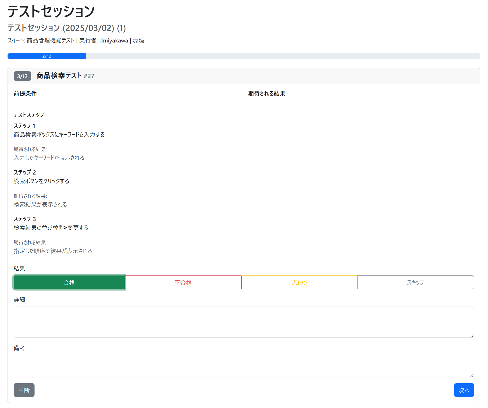

# Test Manager Application

Djangoベースのテスト管理用アプリケーションです。

ここで言う「テスト」とは、主に手動でWebブラウザ等を操作することでテスト対象となるWebアプリケーションが期待通りに動作するかを確認する作業を指します。
継続的に品質管理をする上で、このTest Managerアプリのシナリオをソフトウェアリリース前に随時実装することを想定しています。


## 画面イメージ





## 大まかな使い方

0. ログイン画面からユーザー認証を行います
1. 対象のソフトウェアごとに「プロジェクト」を準備します
2. プロジェクトの中で「テストケース」を作成します。
    * 一つの「テストケース」は複数の「テストステップ」を記述でき、それぞれに「手順」と「期待する結果」を分けて記述できます。
3. 実際に一連のテスト作業を実行する段階で、「テストセッション」を作成します
    * その一回のテスト作業で使用する「テストケース」を選びセッションに含めます
4. テストセッションに含まれているテストをテスターに実行してもらいます。
    * 実行結果によってセッションごとのテスト成功数・失敗数などを記録しておけます
5. テストセッションを通じたテスト作業を繰り返し実行することで、プロジェクト内でのソフトウェア品質の変遷を管理します

[misc/sample_data.csv](misc/sample_data.csv) にインポート可能なプロジェクト用CSVファイルがあります。


## 開発者向け情報

### プロジェクト構成

このプロジェクトは以下のコンポーネントで構成されています：

- **test_manager**: Djangoプロジェクトのメインディレクトリ
- **test_tracking**: テスト管理機能を提供するDjangoアプリケーション

### 使用技術

- Python 3.13 + [uv](https://github.com/astral-sh/uv)
- Django 5.2
- pytest + pytest-django + pytest-cov

Python 3.13をビルド出来るようにしておく必要があります。
例えば Ubuntu 24.04 LTSの場合は以下のように先に関連パッケージをインストールしてください

```bash
sudo apt -y install \
    libxml2-dev libssl-dev libbz2-dev libcurl4-openssl-dev libjpeg-dev libpng-dev libmcrypt-dev \
    libreadline-dev libtidy-dev libxslt-dev autoconf \
    sqlite3 libsqlite3-dev libonig-dev libzip-dev pkg-config php-cli php-mbstring unzip
```

### 基本的な使い方

#### 開発用サーバの起動

```bash
uv run manage.py runserver
```

#### テストの実行

```bash
uv run pytest
```


## ライセンス

このプロジェクトはMITライセンスの下で公開されています - 詳細は[LICENSE](LICENSE)ファイルを参照してください。

### REST API
- Project一覧APIを追加
    - Django Rest Frameworkによる実装を `views.py` から `api.py` に分離しました。
    - `urls.py` を更新し、`api.py` の `ProjectList` ビューを使用するようにしました。
