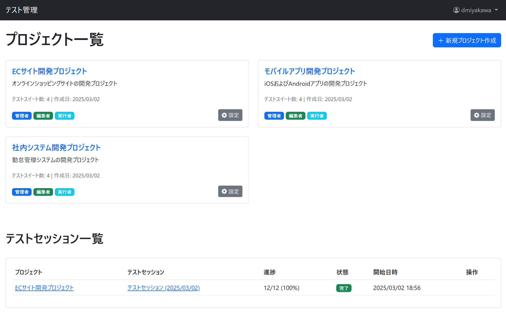
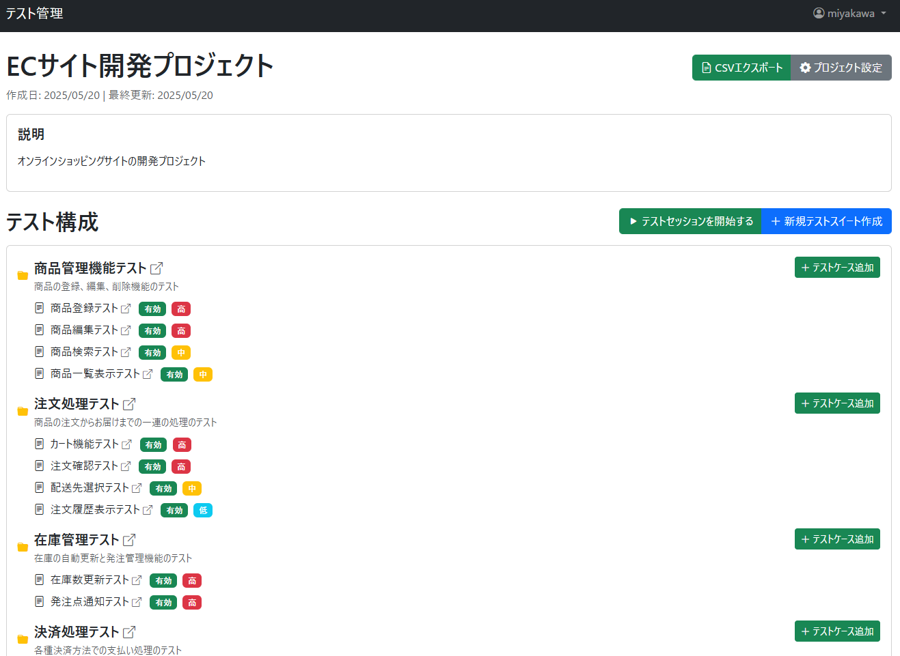

# Test Management Application

Djangoベースのテスト管理アプリケーション。流行りのえーあいで9割くらいやりちらかしてます。

## 画面イメージ






## 機能

- プロジェクト管理
  - プロジェクトの作成・編集
  - メンバー管理と権限制御
- テストスイート管理
  - スイートの作成・編集・削除
  - テストケースのグループ化
- テストケース管理
  - ケースの作成・編集・削除
  - 前提条件、手順、期待結果の管理
  - 優先度とステータスの設定
- テスト実行
  - テスト実行の記録
  - 実行結果の追跡
  - 実行環境の記録
- CSVインポート/エクスポート
  - プロジェクト、スイート、ケース、ステップのCSV管理
  - 一括インポート機能

## セットアップ

1. 仮想環境の作成とアクティベート

```bash
python -m venv venv
source venv/bin/activate
```

2. 依存パッケージのインストール
```bash
pip install -r requirements.txt
```

3. データベースのセットアップ
```bash
python manage.py migrate
```

4. 開発サーバーの起動
```bash
python manage.py runserver
```

## テストデータのインポート

サンプルのテストデータをインポートするには：

```bash
python manage.py import_test_data
```

これにより以下のデータがインポートされます：
- プロジェクト（ECサイト、モバイルアプリ、社内システム）
- テストスイート（各プロジェクトに4つ）
- テストケース（各スイートに2-4件）
- テストステップ（主要なケースに対して）

## テストの実行

1. Djangoテスト
```bash
python manage.py test
```

2. pytestによるテスト（カバレッジレポート付き）
```bash
pytest
```

## 権限システム

Djangoの標準パーミッションシステムを使用して、以下の権限を管理します：

- プロジェクト管理 (manage_project)
  - プロジェクトの編集
  - メンバーの追加・削除
  - 権限の設定
- テスト編集 (edit_tests)
  - テストスイートの作成・編集
  - テストケースの作成・編集
- テスト実行 (execute_tests)
  - テストの実行
  - 結果の記録

各権限はユーザーレベルで管理され、プロジェクトメンバーに対して個別に設定できます。

## 開発者向け情報

- Python 3.13
- Django 5.1.6
- pytest + pytest-django + pytest-cov

## ライセンス

このプロジェクトはMITライセンスの下で公開されています - 詳細は[LICENSE](LICENSE)ファイルを参照してください。
